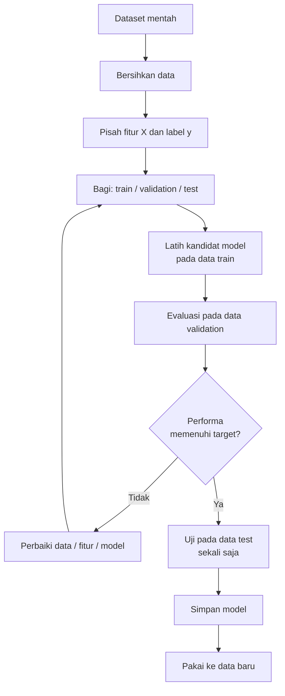
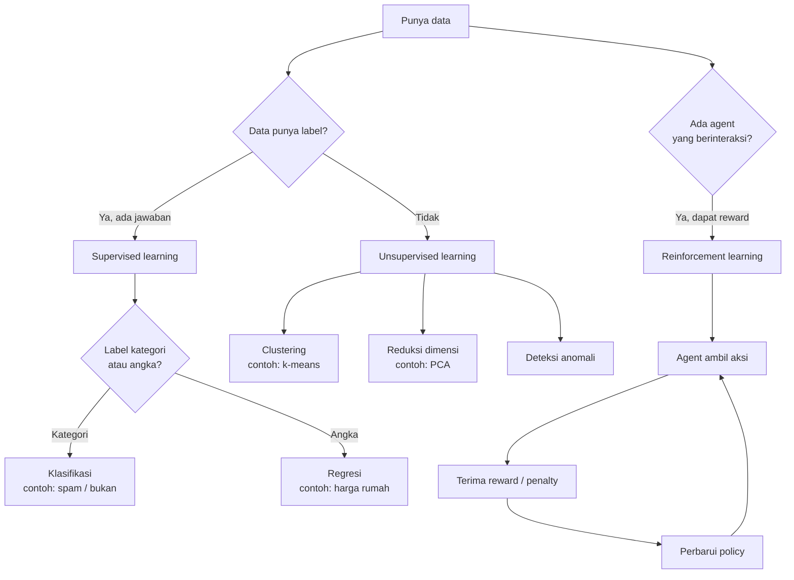
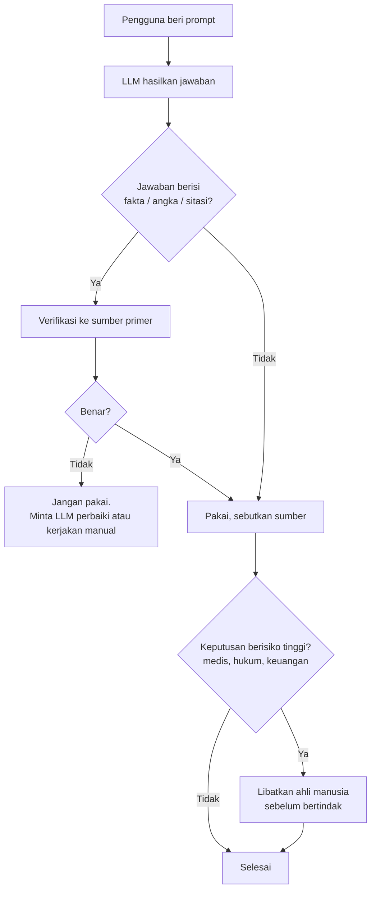

# ML & LLM: Pseudocode dan Flowchart

Pendamping `ml-llm.md`. Dipakai untuk memahami alur, bukan untuk produksi.

## 1. Alur kerja Machine Learning (supervised)

Pseudocode langkah demi langkah, dari data mentah sampai model terpakai:

```text
MULAI
  INPUT: dataset mentah D, daftar label L

  // Tahap 1: siapkan data
  D_bersih = bersihkan(D)          // buang duplikat, isi nilai kosong
  X, y    = pisahkan_fitur_label(D_bersih, L)

  // Tahap 2: bagi data (jangan diacak setelah dibagi)
  X_latih, X_sisa, y_latih, y_sisa = split(X, y, 80%, 20%)
  X_valid, X_uji, y_valid, y_uji   = split(X_sisa, y_sisa, 50%, 50%)

  // Tahap 3: pilih model + hiperparameter lewat validasi
  model_terbaik = TIDAK ADA
  performa_terbaik = 0
  UNTUK setiap kandidat M di [NaiveBayes, SVM, RandomForest]:
      UNTUK setiap hiperparameter H di grid:
          M_latih = latih(M, H, X_latih, y_latih)
          skor    = evaluasi(M_latih, X_valid, y_valid)
          JIKA skor > performa_terbaik:
              model_terbaik   = M_latih
              performa_terbaik = skor

  // Tahap 4: ukur performa akhir (dibuka sekali saja)
  laporan = evaluasi(model_terbaik, X_uji, y_uji)   // precision, recall, F1

  JIKA performa lolos target:
      simpan model_terbaik
      PAKAI ke data baru
  JIKA TIDAK:
      KEMBALI ke Tahap 1   // tambah data, perbaiki fitur, ulangi
SELESAI
```

Catatan penting: data uji (`X_uji`) hanya disentuh di Tahap 4. Kalau dipakai berulang untuk memilih model, hasilnya berhenti jadi pengukur jujur.

## 2. Flowchart alur Machine Learning



## 3. Flowchart tiga paradigma ML



## 4. Alur pelatihan LLM

```text
MULAI
  INPUT: korpus teks raksasa (internet, buku, kode)

  // Tahap 1: ubah teks jadi angka
  token_ids = tokenisasi(korpus)      // kata -> token -> id angka
  embedding = ubah_ke_vektor(token_ids)

  // Tahap 2: pretraining
  ULANGI jutaan langkah:
      prediksi = model(teks_sebelumnya)         // tebak token berikutnya
      error    = bandingkan(prediksi, token_benar)
      perbarui_bobot_model(error)               // backpropagation
  // Hasil: model paham tata bahasa, fakta, gaya penulisan

  // Tahap 3: penyempurnaan
  fine_tuning(model, contoh_instruksi_jawaban)
  rlhf(model, peringkat_jawaban_dari_manusia)

  // Tahap 4: pemakaian (inference)
  INPUT prompt dari pengguna
  ULANGI per token:
      token_baru = model.prediksi_token_berikutnya()
      TAMPILKAN token_baru
  SELESAI SAAT token <akhir> atau batas tercapai
SELESAI
```

## 5. Flowchart pemakaian LLM yang aman



## Cara membaca dokumen ini

Empat blok di atas saling melengkapi: blok 1–2 menunjukkan siklus kerja ML secara umum, blok 3 memetakan pilihan paradigma, blok 4–5 masuk ke LLM dari sisi training sampai pemakaian yang bertanggung jawab. Untuk belajar, coba gambar ulang flowchart dari ingatan tanpa melihat — kalau alurnya sudah benar, konsepnya sudah melekat.
